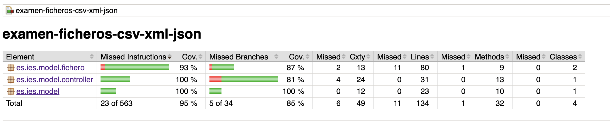

# Examen de  Estructuras de Datos, Ficheros y la Clase `VideoJuego`


## Objetivo

El objetivo de este ejercicio es construir y manipular una serie de datos relacionados con videojuegos. Utilizaremos la clase `VideoJuego` como base para representar los distintos videojuegos y realizar diversas operaciones sobre ellos. Las operaciones se realizarán con el apoyo de **estructuras de datos** como `Set`, `List`, y **ficheros** de distintos formatos como `CSV, JSON y XML`.

## Descripción de la Clase `VideoJuego`

La clase `VideoJuego` es la base del proyecto. Cada objeto `VideoJuego` representará un videojuego con los siguientes atributos:

- **id**: Un identificador único para cada videojuego.
- **nombre**: El nombre del videojuego.
- **genero**: El género del videojuego (por ejemplo, acción, aventura, RPG).
- **fechaLanzamiento**: La fecha de lanzamiento del videojuego (en formato de cadena, `YYYY-MM-DD`).

Esta clase será utilizada para crear una colección de videojuegos, ya sea en memoria o almacenada en un fichero.

### Métodos de la clase `VideoJuego`

La clase `VideoJuego` contará con varios métodos:

- **Constructores**: Para crear objetos `VideoJuego` con distintos niveles de información.
- **Getters y Setters**: Para obtener y modificar los atributos del objeto.
- **Métodos de comparación**: Implementación de `equals()` y `hashCode()` para poder comparar y almacenar correctamente los objetos en estructuras como `Set`.
- **Método `toString()`**: Para generar una representación legible del videojuego.

## Estructuras de Datos Utilizadas

### `Set<VideoJuego>`

La colección `Set` será utilizada para almacenar los videojuegos, ya que esta estructura de datos garantiza que no se repitan los elementos. Cada videojuego tendrá un identificador único (`id`), lo que facilita la verificación de si un videojuego ya está presente en el conjunto.

### Operaciones con Estructuras de Datos

1. **Filtrar videojuegos**: Por plataforma, género, año de lanzamiento, etc.
2. **Obtener videojuegos en un rango de fechas**: Dada una fecha de inicio y una fecha de fin, filtrar los videojuegos lanzados en ese periodo.
3. **Ordenar videojuegos**: Los videojuegos pueden ser ordenados por su nombre, género o fecha de lanzamiento utilizando las capacidades de ordenamiento de las estructuras de datos de Java.
4. **Verificar existencia de un videojuego**: A través de `contains()` o utilizando métodos de comparación basados en el `id` del videojuego.

> **Importante: Estos son algunos ejemplos de las operaciones que se realizan sobre la estructura de datos y que es independiente de los datos almacenados en los ficheros**.

### Funciones a desarrollar

- `obtenerVideoJuegosDespuesDe`. Obtiene una lista lanzados a partir de ese año.
- `obtenerVideoJuegosPorPlataforma`. Obtiene aquellos juegos especificos de una plataforma.
- `obtenerVideoJuegosEntreFechas`. Obtiene la lista de juegos entre dos fechas.
- `obtenerVideoJuegosPorPalabraClave`. Obtenemos los videojuegos cuyo nombre contenga una palabra clave específica.
- `obtenerMasAntiguo`. Obtener el videojuego más antiguo (el primero en el tiempo).

### Datos sobre los que se opera

```csv
1,Super Mario 64,Nintendo,1996-06-23
2,The Legend of Zelda,Nintendo,1986-02-21
3,Doom,Nintendo,1993-12-10
4,Final Fantasy VII,PlayStation,1997-01-31
5,Street Fighter II,Xbox,1991-02-06
6,Metal Gear Solid,Pc,1998-09-03
7,The Elder Scrolls V: Skyrim,Pc,2011-11-11
8,Minecraft,Pc,2011-11-18
9,Half-Life,Xbox,1998-11-19
10,The Witcher 3,PlayStation,2015-05-19
```

## Trabajo con Ficheros

Los videojuegos serán almacenados en **ficheros CSV**, para irse transformando a **XML** y  **JSON**. Cada formato tendrá su propio método de lectura y escritura, permitiendo manipular los datos de diferentes formas.

### Lectura y Escritura en CSV

El formato CSV será utilizado para representar los videojuegos en un formato tabular. Cada línea en el fichero representará un videojuego con campos separados por comas. Ejemplo de formato CSV:

```csv
1,Super Mario 64,Nintendo,1996-06-23
2,The Legend of Zelda,Nintendo,1986-02-21
3,Doom,Nintendo,1993-12-10
4,Final Fantasy VII,PlayStation,1997-01-31
5,Street Fighter II,Xbox,1991-02-06
6,Metal Gear Solid,Pc,1998-09-03
7,The Elder Scrolls V: Skyrim,Pc,2011-11-11
8,Minecraft,Pc,2011-11-18
9,Half-Life,Xbox,1998-11-19
10,The Witcher 3,PlayStation,2015-05-19
```

Almacenado en el fichero: **src/main/resources/videojuegos.csv**.

Este fichero será transformado a un fichero **xml**, y leído porteriomente en este formato, para finalmente escribir en **json**, y recuperar a travvés de la lectura de este formato.

Los métodos a implementar son los siguientes:

- **setToJson()**;
- **fileToJson()**;
- **xmlToSet()**;
- **setToXml()**;
- **csvToSet()**;

### Ficheros generados

#### XML

```xml
<List>
    <VideoJuego>
        <id>1</id>
        <nombre>Super Mario 64</nombre>
        <plataforma>Nintendo</plataforma>
        <fechaLanzamiento>1996-06-23</fechaLanzamiento>
    </VideoJuego>
    <VideoJuego>
        <id>2</id>
        <nombre>The Legend of Zelda</nombre>
        <plataforma>Nintendo</plataforma>
        <fechaLanzamiento>1986-02-21</fechaLanzamiento>
    </VideoJuego>
    <VideoJuego>
        <id>3</id>
        <nombre>Doom</nombre>
        <plataforma>Nintendo</plataforma>
        <fechaLanzamiento>1993-12-10</fechaLanzamiento>
    </VideoJuego>
    <VideoJuego>
        <id>4</id>
        <nombre>Final Fantasy VII</nombre>
        <plataforma>PlayStation</plataforma>
        <fechaLanzamiento>1997-01-31</fechaLanzamiento>
    </VideoJuego>
    <VideoJuego>
        <id>5</id>
        <nombre>Street Fighter II</nombre>
        <plataforma>Xbox</plataforma>
        <fechaLanzamiento>1991-02-06</fechaLanzamiento>
    </VideoJuego>
    <VideoJuego>
        <id>6</id>
        <nombre>Metal Gear Solid</nombre>
        <plataforma>Pc</plataforma>
        <fechaLanzamiento>1998-09-03</fechaLanzamiento>
    </VideoJuego>
    <VideoJuego>
        <id>7</id>
        <nombre>The Elder Scrolls V: Skyrim</nombre>
        <plataforma>Pc</plataforma>
        <fechaLanzamiento>2011-11-11</fechaLanzamiento>
    </VideoJuego>
    <VideoJuego>
        <id>8</id>
        <nombre>Minecraft</nombre>
        <plataforma>Pc</plataforma>
        <fechaLanzamiento>2011-11-18</fechaLanzamiento>
    </VideoJuego>
    <VideoJuego>
        <id>9</id>
        <nombre>Half-Life</nombre>
        <plataforma>Xbox</plataforma>
        <fechaLanzamiento>1998-11-19</fechaLanzamiento>
    </VideoJuego>
    <VideoJuego>
        <id>10</id>
        <nombre>The Witcher 3</nombre>
        <plataforma>PlayStation</plataforma>
        <fechaLanzamiento>2015-05-19</fechaLanzamiento>
    </VideoJuego>
</List>
```

#### Json

```json
[
    {
        "id": 1,
        "nombre": "Super Mario 64",
        "plataforma": "Nintendo",
        "fechaLanzamiento": "1996-06-23"
    },
    {
        "id": 2,
        "nombre": "The Legend of Zelda",
        "plataforma": "Nintendo",
        "fechaLanzamiento": "1986-02-21"
    },
    {
        "id": 3,
        "nombre": "Doom",
        "plataforma": "Nintendo",
        "fechaLanzamiento": "1993-12-10"
    },
    {
        "id": 4,
        "nombre": "Final Fantasy VII",
        "plataforma": "PlayStation",
        "fechaLanzamiento": "1997-01-31"
    },
    {
        "id": 5,
        "nombre": "Street Fighter II",
        "plataforma": "Xbox",
        "fechaLanzamiento": "1991-02-06"
    },
    {
        "id": 6,
        "nombre": "Metal Gear Solid",
        "plataforma": "Pc",
        "fechaLanzamiento": "1998-09-03"
    },
    {
        "id": 7,
        "nombre": "The Elder Scrolls V: Skyrim",
        "plataforma": "Pc",
        "fechaLanzamiento": "2011-11-11"
    },
    {
        "id": 8,
        "nombre": "Minecraft",
        "plataforma": "Pc",
        "fechaLanzamiento": "2011-11-18"
    },
    {
        "id": 9,
        "nombre": "Half-Life",
        "plataforma": "Xbox",
        "fechaLanzamiento": "1998-11-19"
    },
    {
        "id": 10,
        "nombre": "The Witcher 3",
        "plataforma": "PlayStation",
        "fechaLanzamiento": "2015-05-19"
    }
]
```

## Salida Test Examen

| Clase                | Descripción de los Test                                           | Código Compartido                                  |
|----------------------|-------------------------------------------------------------------|---------------------------------------------------|
| **VideoJuego**        | La clase `VideoJuegoTest` es responsable de probar las operaciones relacionadas con la clase `VideoJuego`, como la creación y validación de los atributos del objeto. Este test cubre casos como la correcta asignación de valores a los atributos y la comparación de instancias de `VideoJuego`. | No hay código compartido. Los tests solo verifican las operaciones de la clase `VideoJuego`. |
| **OperacionesFichero**| La clase `OperacionesFicheroTest` testea la lógica de acceso y manipulación de ficheros en `OperacionesFichero`, como la conversión de datos de/para JSON, XML y CSV. Los tests cubren la lectura y escritura en los ficheros. | Puede compartir código con `VideoJuegoTest` si se prueban operaciones como la serialización/deserialización de objetos de tipo `VideoJuego`, pero esto solo ocurre cuando se manipulan ficheros que contienen instancias de `VideoJuego`. |
| **VideoJuegoController** | La clase `VideoJuegoControllerTest` se encarga de probar la lógica del controlador `VideoJuegoController`. Los tests validan el comportamiento de las acciones del controlador, como la obtención de datos, la manipulación de los mismos, y la respuesta a las peticiones del usuario. Este test verifica que el controlador maneje correctamente las interacciones con `OperacionesFichero` y `VideoJuego`. | Comparte código con `OperacionesFicheroTest` en las interacciones con los ficheros (por ejemplo, pruebas de lectura/escritura de `VideoJuego` desde los ficheros), pero con un enfoque más orientado al comportamiento del controlador. |




## Ayudas

### Csv

```java
public void lectura(File file) {
        try (BufferedReader reader = new BufferedReader(new FileReader(file))) {
            String line;
            while ((line = reader.readLine()) != null) {
                System.out.println(line);
            }
        } catch (IOException e) {
            System.out.println("Error al leer el archivo: " + e.getMessage());
        }
    }
    public void escritura(String data,File file) {
        try (BufferedWriter writer = new BufferedWriter(new FileWriter(file, true))) {
            writer.write(data);
            writer.newLine(); // Añadir una nueva línea después del registro
            System.out.println("Registro agregado.");
        } catch (IOException e) {
            System.out.println("Error al escribir en el archivo: " + e.getMessage());
        }
    }
```

### Xml

```java
public void lectura(String[] args) throws Exception {
        File archivo = new File("empleados.xml");
        DocumentBuilderFactory factory = DocumentBuilderFactory.newInstance();
        DocumentBuilder builder = factory.newDocumentBuilder();
        Document doc = builder.parse(archivo);
        
        NodeList lista = doc.getElementsByTagName("empleado");
        for (int i = 0; i < lista.getLength(); i++) {
            Node nodo = lista.item(i);
            if (nodo.getNodeType() == Node.ELEMENT_NODE) {
                Element elemento = (Element) nodo;
                System.out.println("ID: " + elemento.getElementsByTagName("id").item(0).getTextContent());
                System.out.println("Nombre: " + elemento.getElementsByTagName("nombre").item(0).getTextContent());
                System.out.println("Fecha de Nacimiento: " + elemento.getElementsByTagName("fechaNacimiento").item(0).getTextContent());
                System.out.println("Puesto: " + elemento.getElementsByTagName("puesto").item(0).getTextContent());
                System.out.println("---------------------");
            }
        }
    }
    public void escritura(String[] args) throws Exception {
        DocumentBuilderFactory factory = DocumentBuilderFactory.newInstance();
        DocumentBuilder builder = factory.newDocumentBuilder();
        Document doc = builder.newDocument();
        
        Element root = doc.createElement("empleados");
        doc.appendChild(root);
        
        Element empleado = doc.createElement("empleado");
        root.appendChild(empleado);
        
        Element id = doc.createElement("id");
        id.appendChild(doc.createTextNode("1"));
        empleado.appendChild(id);
        
        Element nombre = doc.createElement("nombre");
        nombre.appendChild(doc.createTextNode("Juan Pérez"));
        empleado.appendChild(nombre);
        
        Element fechaNacimiento = doc.createElement("fechaNacimiento");
        fechaNacimiento.appendChild(doc.createTextNode("1993-05-12"));
        empleado.appendChild(fechaNacimiento);
        
        Element puesto = doc.createElement("puesto");
        puesto.appendChild(doc.createTextNode("Desarrollador"));
        empleado.appendChild(puesto);
        
        TransformerFactory transformerFactory = TransformerFactory.newInstance();
        Transformer transformer = transformerFactory.newTransformer();
        DOMSource source = new DOMSource(doc);
        StreamResult result = new StreamResult(new File("empleados.xml"));
        transformer.transform(source, result);
    }
```

### Json

```java
//lectura
ObjectMapper objectMapper = new ObjectMapper();
            return objectMapper.readValue(new File(pathJson), new TypeReference...
//escritura
ObjectMapper objectMapper = new ObjectMapper();
            objectMapper.writeValue...            
```